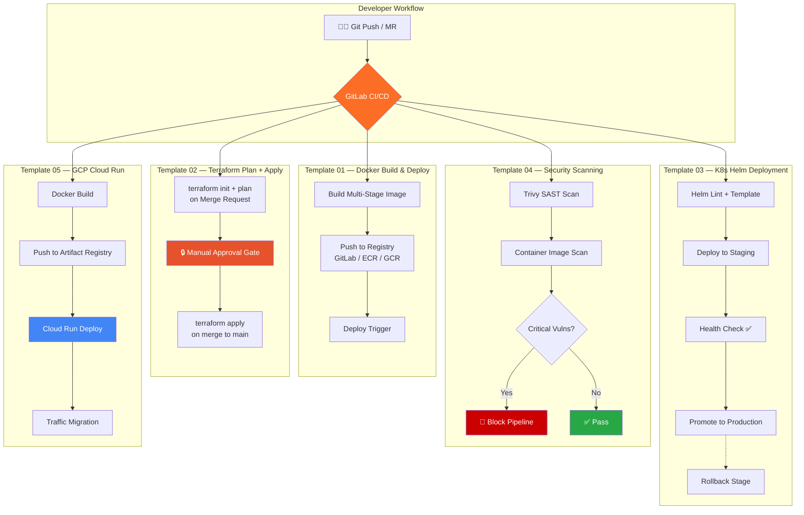

<div align="center">

# GitLab CI/CD Production Templates

**5 enterprise-grade pipeline templates built from 12 years of real-world DevOps**

[](https://about.gitlab.com/)
[](LICENSE)
[](https://maziz00.gumroad.com)
[](https://devopsdispatch.beehiiv.com)

*Used in banks, telecoms, and government entities across the UAE, Saudi Arabia, and Egypt.*

</div>

---

## The Problem

Every DevOps engineer rewrites the same pipeline logic from scratch. Copy-pasting from Stack Overflow. Debugging YAML indentation at 2 AM. Fighting with `only:`/`except:` deprecation warnings.

I've built and maintained hundreds of GitLab pipelines across MENA enterprises. These 5 templates are the distilled result — production-tested, well-documented, and ready to drop into any project.

---

## Architecture Overview



---

## What's Included

| # | Template | Use Case | Key Features |
|---|----------|----------|--------------|
| 01 | `docker-build-deploy.yml` | Docker image CI/CD | Multi-stage builds, layer caching, semantic tagging |
| 02 | `terraform-plan-apply.yml` | Infrastructure as Code | Plan on MR, manual approval, state locking |
| 03 | `k8s-helm-deploy.yml` | Kubernetes deployments | Staging → Production promotion, rollback, health checks |
| 04 | `security-scanning.yml` | DevSecOps pipeline | Trivy SAST + container scan, blocks on critical CVEs |
| 05 | `gcp-cloudrun-deploy.yml` | GCP Cloud Run | Artifact Registry push, traffic migration, revision tagging |

---

## Quick Start

### 1. Clone the repo

```bash
git clone https://github.com/maziz00/gitlab-cicd-templates.git
cd gitlab-cicd-templates
```

### 2. Pick a template

```bash
# Copy the template you need into your project
cp templates/01-docker-build-deploy.yml your-project/.gitlab-ci.yml
```

### 3. Configure variables

Each template has a clearly marked variables section at the top:

```yaml
# ============================================================
# CONFIGURE THESE VARIABLES FOR YOUR PROJECT
# ============================================================
variables:
  DOCKER_REGISTRY: "registry.gitlab.com"       # Your registry
  IMAGE_NAME: "$CI_PROJECT_PATH"                # Image name
  DOCKERFILE_PATH: "Dockerfile"                 # Path to Dockerfile
```

### 4. Push and watch it run

```bash
git add .gitlab-ci.yml
git commit -m "ci: add production CI/CD pipeline"
git push
```

---

## Template Details

### 01 — Docker Build & Deploy

Handles the full container lifecycle: build, tag, push, deploy trigger.

- Multi-stage Docker builds with build cache
- Supports GitLab Container Registry, ECR, and GCR
- Semantic versioning tags (`$CI_COMMIT_TAG`, `$CI_COMMIT_SHORT_SHA`, `latest`)
- Parallel builds for multi-arch images

### 02 — Terraform Plan + Apply

Infrastructure pipeline with safety guardrails.

- `terraform plan` runs automatically on every Merge Request
- `terraform apply` requires manual approval — no accidental infra changes
- Remote state locking (S3/GCS backend)
- `terraform fmt` and `tflint` validation stages
- Works with AWS and GCP providers

### 03 — Kubernetes Helm Deployment

Production-grade Helm deployment with staged rollout.

- Lint → Template → Deploy to Staging → Health Check → Promote to Production
- Automatic rollback on failed health checks
- Helm values per environment (`values-staging.yaml`, `values-production.yaml`)
- `kubectl rollout status` verification

### 04 — Security Scanning (DevSecOps)

Shift-left security integrated into the pipeline.

- Trivy filesystem scan (SAST) for code vulnerabilities
- Trivy image scan for container vulnerabilities
- Pipeline blocks on `CRITICAL` or `HIGH` severity findings
- Results posted to GitLab Security Dashboard
- Configurable severity threshold

### 05 — GCP Cloud Run Deployment

Serverless deployment pipeline for Google Cloud Run.

- Docker build + push to GCP Artifact Registry
- Cloud Run service deployment with revision tagging
- Gradual traffic migration (canary-style)
- Workload Identity Federation authentication (no service account keys)

---

## Compatibility

| Requirement | Version |
|-------------|---------|
| GitLab | 16.0+ |
| Pipeline syntax | `rules:` (not deprecated `only:`/`except:`) |
| Runner | Docker executor or Kubernetes executor |
| GitLab instance | GitLab.com or self-hosted |

---

## Project Structure

```
gitlab-cicd-templates/
├── templates/
│   ├── 01-docker-build-deploy.yml
│   ├── 02-terraform-plan-apply.yml
│   ├── 03-k8s-helm-deploy.yml
│   ├── 04-security-scanning.yml
│   └── 05-gcp-cloudrun-deploy.yml
├── examples/
│   ├── full-pipeline-with-all-stages.yml
│   └── monorepo-multi-service.yml
├── docs/
│   ├── customization-guide.md
│   └── troubleshooting.md
├── LICENSE
└── README.md
```

---

## Who This Is For

- DevOps engineers tired of writing boilerplate pipelines from scratch
- Teams migrating from Jenkins, CircleCI, or GitHub Actions to GitLab
- Startups that need production-ready CI/CD without hiring a platform team
- Enterprise teams in MENA needing compliant, auditable pipelines

---

## Author

**Mohamed AbdelAziz** — Senior DevOps Architect
12 years building enterprise infrastructure across the UAE, KSA, Sudan and Egypt.

- [LinkedIn](https://www.linkedin.com/in/maziz00/) | [Medium](https://medium.com/@maziz00) | [Upwork](https://www.upwork.com/freelancers/maziz00?s=1110580753140797440) | [Consulting](https://calendly.com/maziz00/devops)

---

## License

MIT — use these templates freely in your projects. Attribution appreciated but not required.
